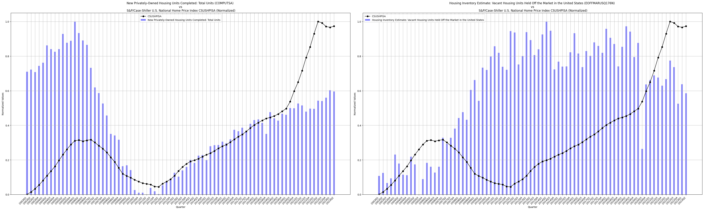
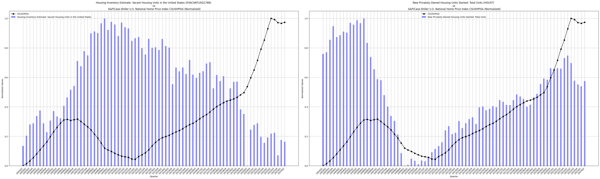
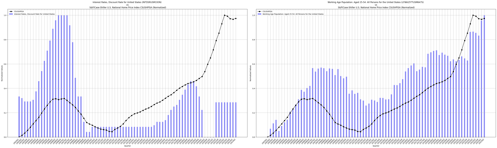
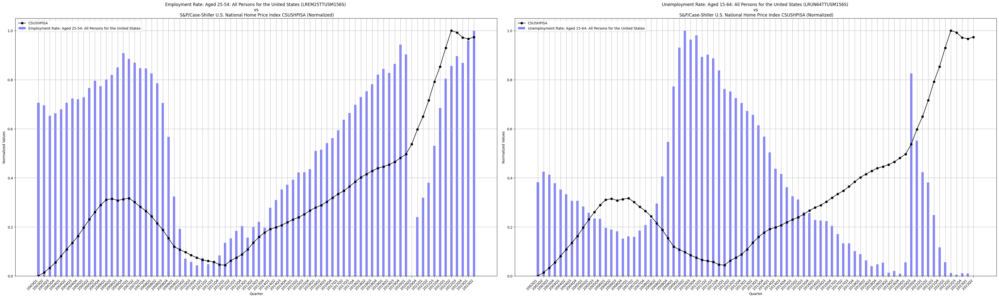
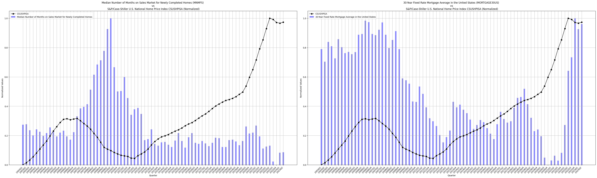
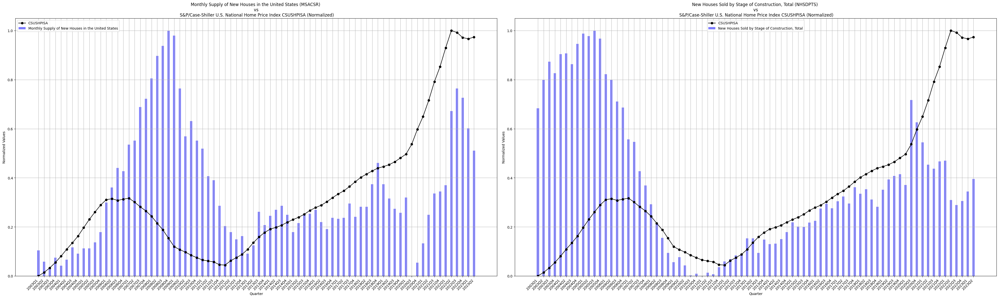
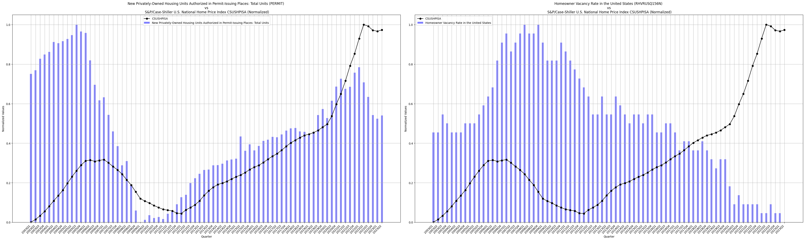
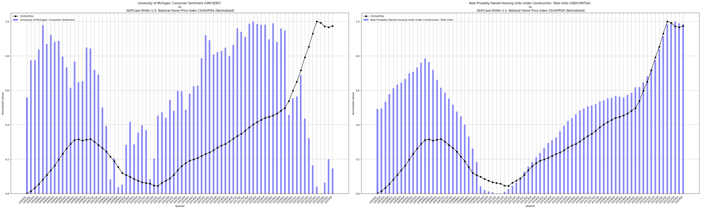

# US Home Prices Analysis

## Supply and demand factors impacting US home prices over the last 20 years

* Considered time period for all supply and demand factors are from 1st January 2003 to 1st April 2023 have quarter of an year incremented values
* All data are from taken from [Economic Research Federal Reserve Bank of St. Louis](https://fred.stlouisfed.org).
* Considered [S&amp;P/Case-Shiller U.S. National Home Price Index](https://fred.stlouisfed.org/series/CSUSHPISA#) as proxy for home prices.
* Considered 30+ factors (refer [Factors.csv](https://github.com/vinayhr01/US-Home-Prices-Analysis-Project/blob/main/Factors.csv) file for all factors) which could have direct or indirect impact on home prices by searching the data source, [Economic Research Federal Reserve Bank of St. Louis](https://fred.stlouisfed.org) using housing related keywords.

### Procedure followed to filter these 30+ factors to more relevant and less factors

* All factors were initially separate CSV files when downloaded from the source mentioned above, but have been merged and converted into a single CSV file (refer [merged_data.csv](https://github.com/vinayhr01/US-Home-Prices-Analysis-Project/blob/main/merged_data.csv) for CSV file) and since factors have code names, the description of these factors were also considered to form a CSV file (refer [Factors.csv](https://github.com/vinayhr01/US-Home-Prices-Analysis-Project/blob/main/Factors.csv) for CSV file).
* If any factors have less data than time period mentioned above, the missing values are handled by using mean simple imputation method and according to requirements.
* For instance, [Interest Rates, Discount Rate for United States (INTDSRUSM193N)](https://fred.stlouisfed.org/series/INTDSRUSM193N) had 7 values missing and had been filled using mean simple imputation method (refer [MLmodel.py](https://github.com/vinayhr01/US-Home-Prices-Analysis-Project/blob/49f7cff5ac010564062e9ea573aca33b851b92b0/MLmodel.py#L19-L31))
* Then found the correlation of all factors with respect to [S&amp;P/Case-Shiller U.S. National Home Price Index](https://fred.stlouisfed.org/series/CSUSHPISA#).
* Based on high correlation values and meaning of the factors, first filtering of a few factors were done and then variance inflation method was applied to further remove factors (refer [multicollinearity.py](https://github.com/vinayhr01/US-Home-Prices-Analysis-Project/blob/main/multicollinearity.py)) thus helping in reducing multicollinearity problem which could arise due to highly correlated predictor and target (refer [delsimfactors.txt](https://github.com/vinayhr01/US-Home-Prices-Analysis-Project/blob/main/delsimfactors.txt) file for factors removal).

### ML Model building

* Initially all values are converted to their appropriate numeric values in the dataset after filtering certain factors based on the above mentioned criteria (refer [final_merged_data.csv](https://github.com/vinayhr01/US-Home-Prices-Analysis-Project/blob/main/final_merged_data.csv) for CSV file) and similarly factors manipulated are updated in another CSV file (refer [final_Factors.csv](https://github.com/vinayhr01/US-Home-Prices-Analysis-Project/blob/main/final_Factors.csv)).
* Then preprocessing of data must be done, such removing outliers from dataset, normalizing the values, because of different types of measured values in the dataset.
* Z-Scores with a certain threshold condition are used to remove outliers, if there are any outliers. Z-Scores determine how far a data point is from the mean of that data in terms of standard deviation, given by Z = (X - mean) / std. deviation, positive Z-score means data point is above the mean and similarly holds true for other conditions.
* Normalization is done using MinMaxScaler which reduces all values to a range of 0 to 1. Then another column caller **QUARTER** is added to the dataset to have quarter divisions for visualization (refer [normalized_data.csv](https://github.com/vinayhr01/US-Home-Prices-Analysis-Project/blob/main/normalized_data.csv))
* Every graph visualization depicts a view of a factor mapped along with home price index to show its variation as shown in below images.
* Then data is split into training and testing data with 80% to 20% ratio.
* 5 different ML algorithms and best algorithm producing the least **Mean Squared Error** are chosen to build the model.
* The parameters to be set for these algorithms are chosen with the help of **hyper-parameter tuning** (refer [hyppara_tune.py](https://github.com/vinayhr01/US-Home-Prices-Analysis-Project/blob/main/hyppara_tune.py)).
* In order to check if data is overfitting or underfitting, baseline predicitons are where mean and median of testing dataset are compared with testing predictions scores of the model, the model here shows a significant differences between them, ensuring that data is not underfitting or overfitting.

### Data Visualizations

* Plot-1 shows home price index comparison with Average Sales Price of Houses sold in US, it clearly shows that both of these parameters go hand-in-hand because prices are directly related.
* Plot-2 shows home price index vs New-Privately owned housing units but not yet started wrt to construction. This graph shows prices of homes increase with increase in number of housing units, a typical behavior similar to above case, as housing units increase, prices also increase.

* Plot-1 above shows that initially supply of housing units was huge, but prices were low, maybe due to affordability of houses during the time, but both supply of housing units and prices declined to very low because of recession during 2007-08 period. But the market gradually picked up and later prices are enormous because of low supply of houses and also affordability of people increased.
* Plot-2 above shows a sort of indirect relationship between home price index and vacant units held off the market. This relationship clearly shows that when vacant units increased, prices are low, this is because people do not want to occupy houses and since there is less demand, but more supply, an indirect relationship so as above.

* 

